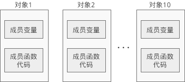
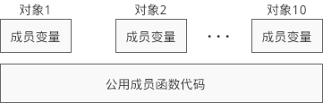

C++对象的内存模型
=================

类是创建对象的模板，不占用内存空间，不存在于编译后的可执行文件中。
而对象是实实在在的数据，需要内存来存储。

.. note::

    根据创建对象的位置，对象会在\ **全局数据区**\ 、\ **栈**\ 或\ **堆**\ 上分配内存。

直观的认识是，如果创建了10个对象，就要分别为这10个对象的成员变量和成员函数分配内存，如下图所示：

不同对象的成员变量的值可能不同，需要单独分配内存来存储，但是不同对象的成员函数的代码是一样的，上面的内存模型保存了10份相同的代码片段，浪费了不少空间，可以将这些代码片段压缩成一份。
事实上编译器也是这样做的，编译器会将成员变量和成员函数分开存储：\ **分别为每个对象的成员变量分配内存，但是所有对象都共享同一段成员函数代码**\ 。
如下图所示：

Example:

.. code-block:: cpp

    #include <iostream>

    using namespace std;

    class Studnet
    {
    private:
        char *m_name;
        int m_age;
        float m_score;

    public:
        void setName(char *name);
        void setAge(int age);
        void setScore(float score);
    };

    void Student::setName(char *name)
    {
        m_name = name;
    }

    void Student::setAge(int age)
    {
        m_age = age;
    }

    void Student::setScore(float score)
    {
        m_score = score;
    }

    // 在全局数据区创建对象
    Student s1;

    int main()
    {
        cout << sizeof(s1) << endl;

        // 在栈上创建对象
        Student s2;
        cout << sizeof(s2) << endl;

        // 在堆上创建对象
        Student *p = new Student;
        cout << sizeof(*p) << endl;

        // 类的大小
        cout << sizeof(Student) << endl;

        cout << sizeof(char *) << ", " << sizeof(int) << ", " << sizeof(float) << endl;

        return 0;
    }

    // 运行结果：
    // 16
    // 16
    // 16
    // 16
    // 8, 4, 4

Student类包含三个成员变量，它们的类型分别是\ ``char *``\ 、\ ``int``\ 、\ ``float``\ ，分别占用8、4、4个字节，加起来共占用16个字节的内存。
通过\ ``sizeof``\ 求得的结果等于16，恰好说明对象所占用的内存仅仅包含了成员变量。

类也可以看作一种复合的数据类型，也可以使用\ ``sizeof``\ 求得该类型的大小。
从运行结果可以看出，在计算这种类型的大小时，只计算了成员变量的大小，并没有把成员函数也包含在内。
对象的大小只受成员变量的影响，和成员函数没有关系。

